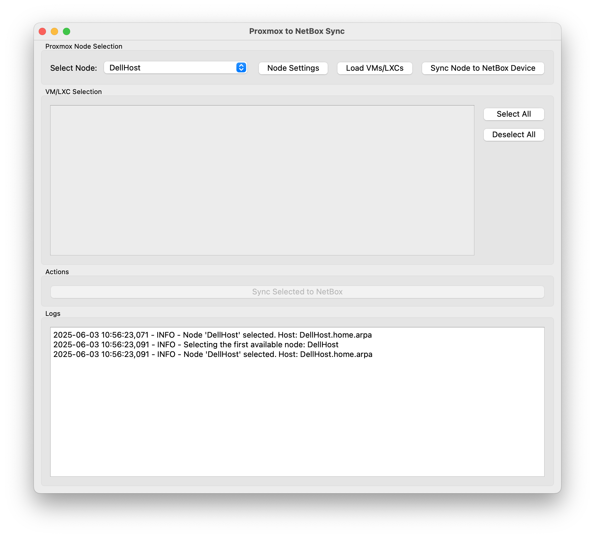

# Proxmox to NetBox Sync GUI

A desktop GUI application for synchronizing Virtual Machines (VMs), LXC Containers, and Proxmox VE nodes (as Devices) from Proxmox environments to a NetBox instance.

## Overview

This tool provides a user-friendly interface to connect to one or more Proxmox VE nodes, fetch information about virtualized resources and the nodes themselves, and then synchronize this data to NetBox. It helps keep your NetBox inventory up-to-date with your Proxmox virtualization platform.

## Features

*   **GUI Interface:** Easy-to-use desktop application built with PyQt6.
*   **Multiple Proxmox Nodes:** Configure and switch between multiple Proxmox nodes.
*   **VM/LXC Synchronization:**
    *   Syncs VMs and LXC containers to NetBox Virtualization.
    *   Maps Proxmox VM status to NetBox VM status.
    *   Syncs vCPUs, memory, and primary disk size.
    *   Syncs network interfaces, including MAC addresses, IP addresses (if static), and VLAN tags.
    *   Syncs Proxmox tags to NetBox tags.
    *   Extracts OS information from Proxmox notes (e.g., `os: Ubuntu 22.04`) or uses `ostype`.
    *   Synchronizes detailed virtual disk information (name, size, storage ID, boot disk).
    *   Populates various Proxmox-specific details into NetBox custom fields.
*   **Proxmox Node to NetBox Device Synchronization:**
    *   Syncs the Proxmox VE node itself as a "Device" in NetBox DCIM.
    *   Allows mapping to NetBox Site, Device Role, Manufacturer, Device Type, and Platform.
    *   Syncs node hardware details (CPU model, sockets, cores, total memory, root FS size) to custom fields.
    *   Syncs node network interfaces (physical, bridges, bonds, VLANs) with their IP addresses to the NetBox Device.
*   **Orphan Handling:** Marks NetBox VMs as "Deleted" (via a custom field) if they no longer exist in Proxmox.
*   **Configuration Management:**
    *   Settings dialog to manage global NetBox connection details and Proxmox node configurations.
    *   Configurations are stored in a local `.env` file or managed via the GUI.
*   **Logging:** View real-time logs of operations within the application.
*   **Background Operations:** Long-running tasks (API calls, synchronization) are performed in background threads to keep the GUI responsive.

### Preserving Node Interfaces in NetBox

During the synchronization of a Proxmox node to a NetBox Device, interfaces that exist in NetBox but are not found in the Proxmox node's configuration are typically considered "orphaned" and are deleted by default.

However, ProxSyncBox will preserve interfaces in NetBox if their standard boolean field `mgmt_only` (Management Only) is set to `True`. This is particularly useful for out-of-band (OOB) management interfaces or other specific logical interfaces that are tracked in NetBox but are not part of the Proxmox node's manageable network configuration. These 'management only' interfaces are not deleted during the node synchronization process due to their specific nature, ensuring they remain in your NetBox inventory.

## Prerequisites

*   **Python:** Version 3.8 or higher.
*   **Proxmox VE:** A running Proxmox VE environment with API access.
    *   An API token for authentication is recommended.
*   **NetBox:** A running NetBox instance (version 3.x or higher recommended) with API access.
    *   An API token with appropriate permissions (read, create, update, delete for virtualization and DCIM components).

### Creating a Proxmox VE API Token

To allow ProxSyncBox to access your Proxmox VE data, you need to create an API token. It's recommended to use a dedicated user and an API token with specific permissions. The `PVEAuditor` role is generally sufficient for this application as it primarily reads data.

1.  **Log in to the Proxmox VE web UI.**
2.  **Create a dedicated user (Optional but Recommended):**
    *   Navigate to **Datacenter > Permissions > Users**.
    *   Click **Add**.
    *   Fill in the User name (e.g., `netbox_sync_user`), select Realm (e.g., `pam` for local users or `pve` for PVE realm users), and set a password (though the password won't be used directly by the token).
    *   Click **Add**.
3.  **Assign `PVEAuditor` Role to the User (or `root@pam`):**
    *   Navigate to **Datacenter > Permissions**.
    *   Click **Add > User Permission**.
    *   Path: `/` (for access to the entire Proxmox VE instance).
    *   User: Select the user you created (e.g., `netbox_sync_user@pam`) or `root@pam` if you choose to use the root user.
    *   Role: Select `PVEAuditor`. This role provides read-only access to most objects.
    *   Click **Add**.
4.  **Create the API Token:**
    *   Navigate to **Datacenter > Permissions > API Tokens**.
    *   Click **Add**.
    *   **User:** Select the user for whom you assigned the `PVEAuditor` role (e.g., `netbox_sync_user@pam` or `root@pam`).
    *   **Token ID:** Enter a descriptive name for the token (e.g., `netbox_sync_token`). This will be your `PROXMOX_NODE_<ID_NAME>_TOKEN_NAME` in the `.env` file or GUI settings.
    *   **Privilege Separation:** You can leave this unchecked for simplicity with the `PVEAuditor` role. If checked, the token would only have the permissions of the selected user *minus* any privileges that require a TTY (like console access), which is fine for API usage.
    *   **Expire:** Optionally, set an expiration date for the token. 0 means no expiration.
    *   Click **Add**.
5.  **Important:** A window will pop up displaying the **Token ID** and the **Secret**.
    *   **Copy the Secret immediately and store it securely.** This is your `PROXMOX_NODE_<ID_NAME>_TOKEN_SECRET`. **The secret will not be shown again.**

You will use the selected User (e.g., `netbox_sync_user@pam`), the Token ID, and the Secret in the ProxSyncBox configuration.

### Creating a NetBox API Token

To allow ProxSyncBox to interact with your NetBox instance, you need to create an API token.

1.  **Log in to your NetBox web UI.**
2.  **Navigate to your User Profile:**
    *   Click on your username in the top right corner.
    *   Select **Profile** from the dropdown menu.
3.  **Go to API Tokens:**
    *   In your profile page, click on the **API Tokens** tab.
4.  **Create a New Token:**
    *   Click the **+ Add a token** button.
    *   **Label (Optional but Recommended):** Provide a descriptive label for the token (e.g., `proxsyncbox_token`).
    *   **Expires (Optional):** You can set an expiration date for the token. If left blank, the token will not expire.
    *   **Write enabled:** Ensure this box is **checked** if you want ProxSyncBox to create or update objects in NetBox. If you only want to read data (not typical for this tool's full functionality), you can leave it unchecked.
    *   **Permissions:** For full functionality, the token will need permissions to create, view, change, and delete various objects. You can assign specific permissions or, for simplicity during initial setup, grant broader permissions. Key areas include:
        *   `virtualization | virtual machine`
        *   `virtualization | interface` (for VMs)
        *   `virtualization | cluster`
        *   `dcim | device`
        *   `dcim | interface` (for Devices/Nodes)
        *   `extras | tag`
        *   And any other objects ProxSyncBox might interact with (e.g., `ipam | ip address` if IP assignment is involved).
    *   Click **Create**.
5.  **Important:** A window will display your new API token.
    *   **Copy the token immediately and store it securely.** **This token will not be shown again.**

You will use this token as the `NETBOX_TOKEN` in the ProxSyncBox configuration.

**Tested Versions:**
*   This application has been tested with NetBox version `4.3.1` and Proxmox VE version `8.4.1`. Compatibility with other versions is likely but not guaranteed.

## Installation

1.  **Clone the Repository:**
    ```bash
    git clone <your-repository-url>
    cd ProxSyncBox
    ```

2.  **Create a Virtual Environment (Recommended):**
    ```bash
    python -m venv venv
    ```
    Activate the virtual environment:
    *   On Windows:
        ```bash
        .\venv\Scripts\activate
        ```
    *   On macOS and Linux:
        ```bash
        source venv/bin/activate
        ```

3.  **Install Dependencies:**
    Install the required Python packages using the provided `requirements.txt` file:
    ```bash
    pip install -r requirements.txt
    ```

## Configuration

The application settings are stored in a `.env` file in the application's root directory. You can configure the application in two ways:

### 1. Via the GUI

*   Launch the application.
*   Go to **File > Settings**.
*   **Global Tab:** Configure your NetBox URL, API Token, and the default NetBox Cluster Type name.
*   **Proxmox Nodes Tab:** Add, edit, or remove Proxmox node configurations.
    *   When adding/editing a node, you'll provide Proxmox connection details and specify how the node and its VMs should be represented in NetBox.
*   Saving settings in the GUI will update the `.env` file.

### 2. Via the `.env` File (Manual Configuration)

If the `.env` file does not exist, the application will attempt to create an empty one when you first run it or open settings. You can also create it manually.

**Example `.env` file:**

```env
NETBOX_URL=https://netbox.example.com
NETBOX_TOKEN=your_netbox_api_token_here
NETBOX_CLUSTER_TYPE_NAME=Proxmox VE

# Proxmox Node Configurations

# Node: pve-cluster-main-node1
PROXMOX_NODE_PVE-CLUSTER-MAIN-NODE1_ID_NAME=pve-cluster-main-node1
PROXMOX_NODE_PVE-CLUSTER-MAIN-NODE1_HOST=192.168.1.10
PROXMOX_NODE_PVE-CLUSTER-MAIN-NODE1_NODE_NAME=node1
PROXMOX_NODE_PVE-CLUSTER-MAIN-NODE1_USER=root@pam
PROXMOX_NODE_PVE-CLUSTER-MAIN-NODE1_TOKEN_NAME=netbox_sync_token
PROXMOX_NODE_PVE-CLUSTER-MAIN-NODE1_TOKEN_SECRET=xxxxxxxx-xxxx-xxxx-xxxx-xxxxxxxxxxxx
PROXMOX_NODE_PVE-CLUSTER-MAIN-NODE1_NETBOX_CLUSTER_NAME=ProxmoxMainCluster
PROXMOX_NODE_PVE-CLUSTER-MAIN-NODE1_NETBOX_NODE_SITE_NAME=Main-Datacenter
PROXMOX_NODE_PVE-CLUSTER-MAIN-NODE1_NETBOX_NODE_DEVICE_ROLE_NAME=Hypervisor
PROXMOX_NODE_PVE-CLUSTER-MAIN-NODE1_NETBOX_NODE_MANUFACTURER_NAME=Dell
PROXMOX_NODE_PVE-CLUSTER-MAIN-NODE1_NETBOX_NODE_DEVICE_TYPE_NAME=PowerEdge R740
PROXMOX_NODE_PVE-CLUSTER-MAIN-NODE1_NETBOX_NODE_PLATFORM_NAME=
PROXMOX_NODE_PVE-CLUSTER-MAIN-NODE1_VERIFY_SSL=false

# Node: lab-node-alpha
PROXMOX_NODE_LAB-NODE-ALPHA_ID_NAME=lab-node-alpha
PROXMOX_NODE_LAB-NODE-ALPHA_HOST=lab-pve.internal
PROXMOX_NODE_LAB-NODE-ALPHA_NODE_NAME=lab-pve-alpha
PROXMOX_NODE_LAB-NODE-ALPHA_USER=sync_user@pve
PROXMOX_NODE_LAB-NODE-ALPHA_TOKEN_NAME=netbox_token
PROXMOX_NODE_LAB-NODE-ALPHA_TOKEN_SECRET=yyyyyyyy-yyyy-yyyy-yyyy-yyyyyyyyyyyy
PROXMOX_NODE_LAB-NODE-ALPHA_NETBOX_CLUSTER_NAME=LabCluster
PROXMOX_NODE_LAB-NODE-ALPHA_VERIFY_SSL=true
```

**Parameter Explanations:**

**Global Settings:**

*   `NETBOX_URL`: The full base URL of your NetBox instance (e.g., `https://netbox.yourdomain.com`).
*   `NETBOX_TOKEN`: Your NetBox API token.
*   `NETBOX_CLUSTER_TYPE_NAME`: The name for the Cluster Type in NetBox that will be used for Proxmox clusters (e.g., "Proxmox VE"). Defaults to "Proxmox VE" if not set. This type will be created in NetBox if it doesn't exist.

**Proxmox Node Settings:**

Each Proxmox node configuration is prefixed with `PROXMOX_NODE_<ID_NAME>_`, where `<ID_NAME>` is a unique identifier you define for the node configuration (e.g., `PVE-CLUSTER-MAIN-NODE1` in the example).

*   `PROXMOX_NODE_<ID_NAME>_ID_NAME`: The unique identifier for this node configuration. **Must match the `<ID_NAME>` used in the prefix.**
*   `PROXMOX_NODE_<ID_NAME>_HOST`: The hostname or IP address of the Proxmox VE server.
*   `PROXMOX_NODE_<ID_NAME>_NODE_NAME`: The actual node name as defined within Proxmox (e.g., `pve1`, `server01`). This is used in API calls to target the specific node.
*   `PROXMOX_NODE_<ID_NAME>_USER`: The Proxmox user for API authentication (e.g., `root@pam` or `your_api_user@pve`).
*   `PROXMOX_NODE_<ID_NAME>_TOKEN_NAME`: The name of the API token created in Proxmox for the specified user.
*   `PROXMOX_NODE_<ID_NAME>_TOKEN_SECRET`: The secret value of the Proxmox API token.
*   `PROXMOX_NODE_<ID_NAME>_NETBOX_CLUSTER_NAME`: The name of the NetBox Cluster where VMs/LXCs from this Proxmox node will be grouped. If left empty, it defaults to the Proxmox `NODE_NAME`.
*   `PROXMOX_NODE_<ID_NAME>_VERIFY_SSL`: Set to `true` or `false`. Whether to verify SSL certificates when connecting to the Proxmox API. Set to `false` for self-signed certificates (less secure).

*Optional fields for representing the Proxmox node itself as a Device in NetBox:*

*   `PROXMOX_NODE_<ID_NAME>_NETBOX_NODE_SITE_NAME`: (Optional) The name of the NetBox Site to assign this Proxmox node (as a Device).
*   `PROXMOX_NODE_<ID_NAME>_NETBOX_NODE_DEVICE_ROLE_NAME`: (Optional) The name of the NetBox Device Role (e.g., "Hypervisor", "Server"). Defaults to "Hypervisor".
*   `PROXMOX_NODE_<ID_NAME>_NETBOX_NODE_MANUFACTURER_NAME`: (Optional) The name of the NetBox Manufacturer.
*   `PROXMOX_NODE_<ID_NAME>_NETBOX_NODE_DEVICE_TYPE_NAME`: (Optional) The name of the NetBox Device Type (e.g., "Dell PowerEdge R740").
*   `PROXMOX_NODE_<ID_NAME>_NETBOX_NODE_PLATFORM_NAME`: (Optional) The name of the NetBox Platform. If left empty, the application will attempt to use "Proxmox VE [version]" based on the fetched PVE version.

**Note:** Boolean values (`VERIFY_SSL`) should be `true` or `false`.

## Running the Application

Once dependencies are installed and configuration is set up (at least minimally via GUI or `.env`), run the application from its root directory:

```bash
python gui_app.py
```

## Usage

### Main Window Overview

*   **Proxmox Node Selection:**
    *   **Select Node:** Dropdown to choose a configured Proxmox node.
    *   **Node Settings:** Button to open the settings dialog directly to the Proxmox Nodes tab.
    *   **Load VMs/LXCs:** Fetches VMs and LXCs from the selected Proxmox node.
    *   **Sync Node to NetBox Device:** Synchronizes the selected Proxmox node itself as a Device in NetBox.
*   **VM/LXC Selection:**
    *   A scrollable list of VMs/LXCs fetched from the selected node. Check the boxes for those you want to synchronize.
    *   **Select All / Deselect All:** Buttons to manage selections.
*   **Actions:**
    *   **Sync Selected to NetBox:** Initiates the synchronization of selected VMs/LXCs to NetBox.
*   **Logs:** A text area displaying real-time logs of application activity.
*   **Menu Bar (File > Settings):** Access the main settings dialog.

### Workflow

1.  **Configure Global Settings (First Time):**
    *   Go to **File > Settings**.
    *   In the "Global" tab, enter your NetBox URL and API Token.
    *   Adjust the "NetBox Default Cluster Type Name" if needed.
    *   Click "Save".

2.  **Configure Proxmox Nodes:**
    *   Go to **File > Settings** and select the "Proxmox Nodes" tab (or click the "Node Settings" button).
    *   Click "Add Node".
    *   Fill in the Proxmox connection details (`ID Name`, `Host`, `Node Name`, `User`, `Token Name`, `Token Secret`).
    *   Specify the `NetBox Cluster Name` for grouping VMs from this node.
    *   (Optional) Fill in the `NetBox Node Site Name`, `Device Role Name`, etc., if you plan to sync the Proxmox node itself as a NetBox Device.
    *   Click "OK" to save the node configuration.
    *   Repeat for all Proxmox nodes you want to manage.
    *   Click "Save" in the main settings dialog.

3.  **Load VMs/LXCs:**
    *   Select a configured Proxmox node from the "Select Node" dropdown.
    *   Click the "Load VMs/LXCs" button.
    *   The list below will populate with VMs and LXCs from that node.

4.  **Synchronize VMs/LXCs to NetBox:**
    *   Check the boxes next to the VMs/LXCs you wish to synchronize.
    *   Click the "Sync Selected to NetBox" button.
    *   The application will create or update these VMs/LXCs in NetBox, including their interfaces, disks, tags, and other details.
    *   It will also mark VMs in NetBox as "Deleted" (via a custom field) if they are part of the target cluster but no longer exist on the Proxmox node and were not part of the current sync selection (effectively, if they were previously synced from this node but are now gone).

5.  **Synchronize Proxmox Node to NetBox Device:**
    *   Select a configured Proxmox node from the "Select Node" dropdown.
    *   Ensure the node configuration (in Settings) has the desired NetBox Device mapping fields (Site, Role, etc.) filled in.
    *   Click the "Sync Node to NetBox Device" button.
    *   The application will create or update a Device in NetBox representing this Proxmox node, along with its network interfaces and hardware details (in custom fields).

6.  **Viewing Logs:**
    *   All operations, progress, and errors are logged in the "Logs" text area at the bottom of the window.

## Expected NetBox Custom Fields

For full functionality, especially for storing Proxmox-specific details, the application expects certain custom fields to exist in your NetBox instance. You will need to create these manually or import the file (assets/Custom Fields.csv) in NetBox under **Customization > Custom Fields**.


**For Virtual Machines (Content Type: virtualization | virtual machine):**

*   `vm_status` (Type: Text or Selection, e.g., "Deployed", "Deleted") - Used to mark VMs that are no longer in Proxmox.
*   `vm_last_sync` (Type: Date/Time) - Timestamp of the last successful sync.
*   `vmid` (Type: Integer) - Proxmox VM/LXC ID.
*   `cpu_sockets` (Type: Integer) - Number of CPU sockets (for QEMU).
*   `min_memory_mb` (Type: Integer) - Minimum allocated memory in MB (for QEMU).
*   `qemu_cpu_type` (Type: Text) - QEMU CPU type.
*   `qemu_bios_type` (Type: Text) - QEMU BIOS type.
*   `qemu_machine_type` (Type: Text) - QEMU machine type.
*   `qemu_numa_enabled` (Type: Boolean) - QEMU NUMA status.
*   `qemu_cores_per_socket` (Type: Integer) - QEMU cores per socket.
*   `qemu_boot_order` (Type: Text) - QEMU boot order string.
*   `lxc_architecture` (Type: Text) - LXC architecture.
*   `lxc_unprivileged` (Type: Boolean) - LXC unprivileged status.
*   `lxc_features` (Type: Text) - LXC features string.
*   `boot_disk_storage` (Type: Text) - Storage ID of the boot disk.
*   `boot_disk_format` (Type: Text) - Format of the boot disk (e.g., qcow2, raw).
*   `lxc_rootfs_storage` (Type: Text) - Storage ID of the LXC rootfs.

**For VM Interfaces (Content Type: virtualization | interface):**

*   `bridge` (Type: Text) - Proxmox bridge the interface is connected to.
*   `interface_model` (Type: Text) - Proxmox interface model (e.g., virtio, e1000).

**For Devices (representing Proxmox Nodes) (Content Type: dcim | device):**

*   `proxmox_pve_version` (Type: Text) - Proxmox VE version.
*   `proxmox_cpu_model` (Type: Text) - CPU model of the node.
*   `proxmox_cpu_sockets` (Type: Integer) - Number of CPU sockets in the node.
*   `proxmox_cpu_cores_total` (Type: Integer) - Total logical CPU cores in the node.
*   `proxmox_memory_total_gb` (Type: Integer) - Total memory in GB.
*   `proxmox_rootfs_total_gb` (Type: Integer) - Total root filesystem size in GB.
*   `proxmox_node_last_sync` (Type: Date/Time) - Timestamp of the last successful node sync.

**For Device Interfaces (on Proxmox Node Device) (Content Type: dcim | interface):**

*   `proxmox_interface_type` (Type: Text) - Original Proxmox interface type (e.g., bridge, bond, eth).
*   `proxmox_interface_ports` (Type: Text) - Slaves for a bond or ports for a bridge.

*Ensure the "Name" (slug) of the custom field matches these suggestions for the application to use them automatically.*

## Screenshots

Here are a few glimpses of ProxSyncBox in action:

**Main Application Window:**
 

## Operating System Support

This application is built with Python and PyQt6 and should run on any operating system that supports Python and can install the PyQt6 library, including:

*   Windows
*   macOS
*   Linux

## Troubleshooting

*   **`urllib3` / `NotOpenSSLWarning` / `LibreSSL` Warning (macOS):**
    You might see a warning like: `NotOpenSSLWarning: urllib3 v2 only supports OpenSSL 1.1.1+, currently the 'ssl' module is compiled with 'LibreSSL ...'`.
    This is common on macOS where Python's `ssl` module might be linked against LibreSSL instead of OpenSSL 1.1.1+. The application attempts to disable this specific warning for insecure requests (when `verify_ssl=false`). For production or secure environments, ensure your Python is compiled with a compatible OpenSSL version or manage certificates appropriately. The application should still function, especially if `verify_ssl` is set to `false` for Proxmox connections with self-signed certificates.
*   **Connection Errors:**
    *   Ensure the Proxmox host/IP, user, token name, and token secret are correct.
    *   Verify network connectivity to your Proxmox and NetBox instances.
    *   Check firewall rules.
    *   If using SSL, ensure `verify_ssl` is set appropriately. For self-signed certificates on Proxmox, set it to `false`.
*   **NetBox API Token Permissions:** Ensure your NetBox API token has sufficient permissions to create, read, update, and delete the relevant objects (VMs, interfaces, clusters, tags, devices, etc.).
*   **Missing Custom Fields:** If data doesn't appear in certain NetBox fields, ensure the corresponding custom fields (as listed above) are created in NetBox with the correct content type and name.

## Dependencies

The core Python dependencies are:

*   `PyQt6`: For the graphical user interface.
*   `proxmoxer`: Python client for the Proxmox VE API.
*   `pynetbox`: Python client for the NetBox API.
*   `python-dotenv`: For managing settings in the `.env` file.
*   `requests`: HTTP library (often a sub-dependency, but listed for clarity).

(See `requirements.txt` for a full list of direct dependencies).

## Contributing

Contributions are welcome! Please feel free to submit pull requests or open issues for bugs, feature requests, or improvements.

## License

This project is licensed under the MIT License - see the LICENSE file for details.
